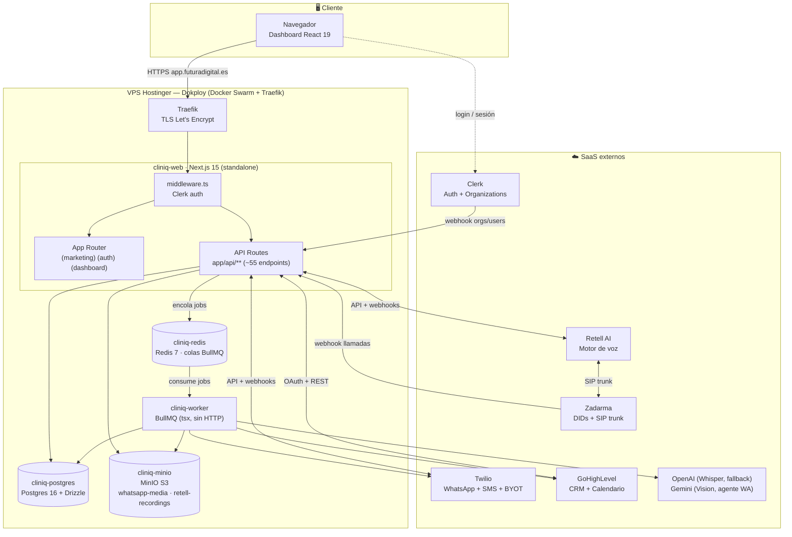
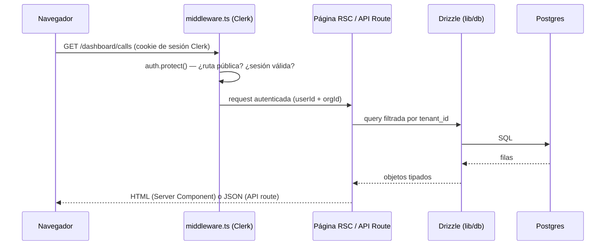
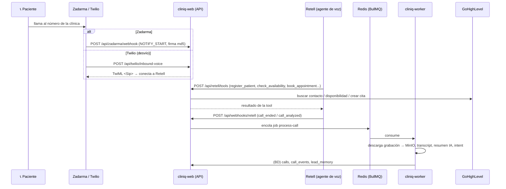
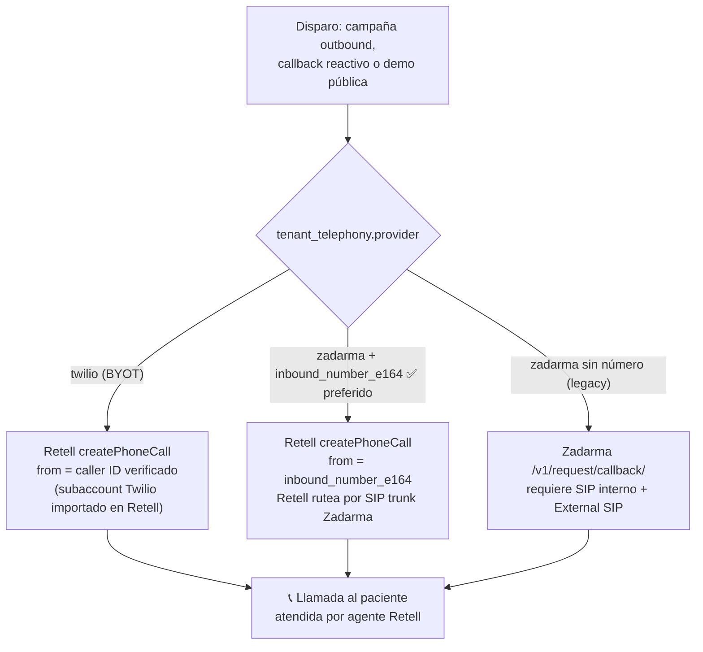
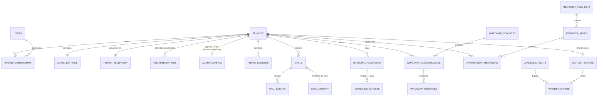

# Arquitectura del sistema

> Parte de la [Documentación para Desarrolladores](./README.md). Ver también: [Setup local](./02-setup.md) · [Referencia de API](./03-api-referencia.md) · [Deployment](./04-deployment.md).

**CliniQ / DentalVoice** es un SaaS multi-tenant para clínicas odontológicas/estéticas que provee:

- **Agente de voz con IA** (Retell) para llamadas entrantes y salientes: atiende, identifica al paciente, agenda/cancela/reagenda citas contra GoHighLevel, responde FAQs y transfiere a humano.
- **Agente de WhatsApp con IA** (Gemini con fallback a OpenAI) + inbox humano.
- **Recordatorios de citas** y **lista de espera** (ofertas automáticas de huecos cancelados) por WhatsApp/voz.
- **Campañas outbound** de llamadas.

## 1. Vista general de componentes



**Piezas clave:**

| Componente | Tecnología | Responsabilidad |
|---|---|---|
| Frontend | Next.js 15 App Router, React 19, Tailwind v4 + shadcn/ui, Recharts | Dashboard multi-tenant (llamadas, WhatsApp inbox, campañas, recordatorios, waitlist, settings) |
| Backend HTTP | Next.js API Routes (mismo proceso que el frontend) | API REST interna, webhooks de terceros, tools del agente de voz |
| Worker | Proceso Node separado (`apps/web/worker/index.ts`, BullMQ) | Trabajo async: post-procesado de llamadas, agente WhatsApp, recordatorios, waitlist |
| Base de datos | Postgres 16 + Drizzle ORM (`apps/web/lib/db/schema.ts`) | ~43 tablas multi-tenant (ver §5) |
| Cola | Redis 7 + BullMQ | 6 colas tipadas (ver §4) |
| Storage | MinIO (S3-compatible) | `whatsapp-media` (público read) y `retell-recordings` (privado) |
| Auth | Clerk (Organizations) | Login + multi-tenancy: 1 organización Clerk = 1 tenant |

> ⚠️ **Histórico**: el proyecto se migró de Vercel + Supabase + Inngest + Cloudflare R2 a este stack self-hosted en Dokploy. Supabase, Inngest y R2 nativo están **deprecados** (el módulo `lib/r2/client.ts` se mantiene por compatibilidad pero apunta a MinIO). Ver `CLAUDE.md`.

## 2. Frontend ↔ Backend ↔ Base de datos

No hay un backend separado: **Next.js sirve el frontend y la API en el mismo proceso**. El flujo de una petición:



- **Server Components** leen la BD directamente vía Drizzle (`apps/web/lib/db/client.ts`, driver `postgres.js`).
- **Client Components** llaman a la API REST (`/api/...`) con `fetch`; la sesión viaja en cookies de Clerk.
- **Multi-tenancy**: el `orgId` de Clerk se mapea a `tenants.clerk_org_id`. Toda tabla de negocio tiene `tenant_id` y cada query/endpoint filtra por él (helper `apps/web/lib/tenant.ts`).
- **Rutas públicas** (sin sesión): `/`, `/sign-in`, `/sign-up`, `/api/health`, `/api/webhooks/*`, `/api/retell/*`, `/api/twilio/*`, `/api/zadarma/*`, `/api/public/*` — cada webhook valida su propia firma (ver [Referencia de API](./03-api-referencia.md)).

## 3. Flujos de telefonía

### 3.1 Llamada entrante (inbound)

Dos vías de entrada según el proveedor del tenant (`tenant_telephony.provider`):



### 3.2 Llamada saliente (outbound) — 3 paths

`apps/web/lib/calls/trigger-callback.ts` ramifica según `tenant_telephony.provider`:



### 3.3 Post-procesado de llamadas

Cada `call_ended`/`call_analyzed` de Retell encola `process-call`; el worker descarga la grabación al bucket `retell-recordings` de MinIO, guarda transcript/resumen, clasifica el intent (`book | reschedule | cancel | faq | pricing | location | human | other`) y actualiza memoria del lead.

## 4. Worker y colas BullMQ

Productores: API routes (webhooks, endpoints de dispatch). Consumidor: proceso `cliniq-worker` (6 workers, concurrencia 2 por cola configurable con `WORKER_CONCURRENCY_*`).

| Cola / job | Encolado por | Qué hace (`apps/web/worker/jobs/`) |
|---|---|---|
| `wa-process` | Webhooks WhatsApp (Twilio/Evolution/Cloud) | Corre el agente IA de WhatsApp (Gemini → fallback OpenAI): Whisper para audios, Gemini Vision para imágenes/PDF, tool-calling contra GHL. Gate global `WHATSAPP_AGENT_ENABLED` |
| `process-call` | Webhook Retell | Grabación → MinIO, transcript, resumen, intent, `lead_memory` |
| `reminder-send` | Programador de recordatorios (delay = `scheduled_for - now`) | Envía el recordatorio (WhatsApp/voz) según plantilla |
| `reminder-fallback-check` | El propio `reminder-send` al terminar | Verifica confirmación; dispara canal de fallback si no hubo respuesta |
| `waitlist-offer-send` | Detección de `cancelled_slots` | Ofrece el hueco liberado al siguiente de la lista de espera |
| `waitlist-offer-expire` | `waitlist-offer-send` (delay = TTL de la oferta) | Expira la oferta y avanza al siguiente candidato |

Los jobs se definen tipados en `apps/web/lib/queue/queues.ts` (una cola = un tipo de job). `lib/queue/step.ts` provee un runner de pasos idempotentes al estilo Inngest.

## 5. Modelo de datos (Postgres)

Esquema completo en `apps/web/lib/db/schema.ts` (Drizzle) y versionado en SQL en `supabase/migrations/0000...0017`. Entidades núcleo:



Dominios y tablas principales (~43 en total):

| Dominio | Tablas |
|---|---|
| Tenancy y auth | `tenants`, `users`, `tenant_memberships`, `tenant_modules` |
| Configuración de clínica | `clinic_settings`, `treatments`, `faqs`, `agent_configs`, `agent_prompt_versions` |
| Integraciones | `ghl_integrations` (tokens OAuth/PIT cifrados con `ENCRYPTION_KEY`), `tenant_telephony` (credenciales Twilio/Zadarma cifradas), `phone_numbers` |
| Llamadas | `calls`, `call_events`, `lead_memory`, `patients_cache`, `appointments_cache` |
| Outbound | `outbound_campaigns`, `outbound_targets` |
| WhatsApp | `whatsapp_connections`, `whatsapp_contacts`, `whatsapp_contact_notes`, `whatsapp_conversations`, `whatsapp_messages`, `whatsapp_tags`, `whatsapp_conversation_tags`, `whatsapp_quick_replies`, `whatsapp_agent_settings`, `whatsapp_agent_runs` |
| Recordatorios | `reminder_rule_sets`, `reminder_rules`, `reminder_message_templates`, `appointment_reminders`, `reminder_confirmations`, `reminder_skip_log` |
| Waitlist | `waitlist_settings`, `waitlist_entries`, `waitlist_offers`, `waitlist_message_templates`, `cancelled_slots`, `scheduling_offers` |
| Operación | `webhook_logs`, `audit_logs`, `billing_subscriptions` |

**Convenciones:**
- PKs `uuid`, timestamps `timestamptz` con `created_at`/`updated_at`.
- Aislamiento por `tenant_id` en todas las tablas de negocio (RLS definido en las migraciones SQL).
- Secretos por tenant (tokens GHL, credenciales Twilio/Zadarma) cifrados en la aplicación con AES via `lib/crypto.ts` + `ENCRYPTION_KEY`.

## 6. Estructura del monorepo

```
llamadaSalientes/                 (pnpm workspace)
├── apps/web/                     # App Next.js + worker
│   ├── app/                      # App Router
│   │   ├── (marketing)/          # Landing pública
│   │   ├── (auth)/               # sign-in / sign-up (Clerk)
│   │   ├── (dashboard)/dashboard # UI del SaaS (calls, whatsapp, outbound, reminders, waitlist, settings…)
│   │   └── api/                  # ~55 endpoints REST + webhooks
│   ├── components/               # UI (shadcn/ui)
│   ├── lib/                      # Núcleo del backend
│   │   ├── db/                   # Drizzle client + schema.ts
│   │   ├── queue/                # BullMQ (client, queues, step runner)
│   │   ├── calls/  retell/  telephony/  zadarma/  twilio/
│   │   ├── whatsapp/             # Inbox + agente IA (tools, eval)
│   │   ├── reminders/  waitlist/  outbound/
│   │   ├── ghl/                  # OAuth + REST GoHighLevel
│   │   ├── gemini/  openai/  rag/
│   │   ├── storage/  r2/         # S3/MinIO
│   │   ├── env.ts                # Validación Zod de env vars
│   │   └── crypto.ts  tenant.ts  auth.ts  logger.ts
│   ├── worker/                   # Entry del worker BullMQ + jobs/
│   └── tests/                    # Vitest + Playwright
├── packages/
│   ├── db-schema/                # (placeholder para compartir schema)
│   └── shared-types/             # Intent, Role
├── supabase/migrations/          # SQL versionado 0000…0017 (se aplica a Postgres self-hosted)
├── scripts/migrate/              # Migración Supabase → self-hosted (histórico)
├── docs/                         # 📚 Esta documentación
├── Dockerfile.web                # Imagen Next.js standalone
├── Dockerfile.worker             # Imagen worker (tsx)
└── docker-compose.yml            # Stack local: Postgres + Redis + MinIO (+ web + worker)
```

## 7. Seguridad

- **Autenticación**: Clerk gestiona sesiones y organizaciones; `middleware.ts` protege todo excepto la lista blanca de rutas públicas.
- **Webhooks**: cada proveedor valida firma propia — Svix (Clerk), `x-retell-signature` (Retell), firma HMAC de Twilio, firma md5 (Zadarma), llave pública (GHL).
- **Secretos por tenant**: cifrados at-rest con `ENCRYPTION_KEY` (AES-256-GCM en `lib/crypto.ts`).
- **Contenedores**: usuarios no-root, `tini` como init, Next standalone sin source ni dev-deps.
- **Red**: Postgres/Redis/MinIO solo accesibles en la red interna `dokploy-network`; únicamente Traefik expone 443.
