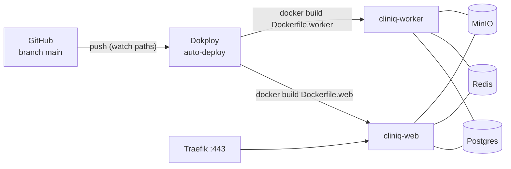

# Despliegue (Deployment)

> Parte de la [Documentación para Desarrolladores](./README.md). Ver también: [Arquitectura](./01-arquitectura.md) · [Setup local](./02-setup.md) · [Referencia de API](./03-api-referencia.md).

La aplicación **NO se despliega en Vercel ni usa Supabase/Inngest** (stack anterior, deprecado). Producción corre **self-hosted en Dokploy** (Docker Swarm + Traefik) sobre un VPS Hostinger.

## 1. Topología de producción

| Servicio | Tipo Dokploy | Dominio | Rol |
|---|---|---|---|
| `cliniq-postgres` | Database (Postgres 16) | interno :5432 | BD principal (db/user `cliniq`), volumen persistente |
| `cliniq-redis` | Database (Redis 7) | interno :6379 | Colas BullMQ + pub/sub SSE, con password |
| `cliniq-minio` | Application (imagen `minio/minio`) | `s3.futuradigital.es` (API), `minio.futuradigital.es` (consola) | Buckets `whatsapp-media` (público read) y `retell-recordings` (privado) |
| `cliniq-web` | Application (Git → `Dockerfile.web`) | `app.futuradigital.es` | Next.js 15 standalone, puerto 3000 |
| `cliniq-worker` | Application (Git → `Dockerfile.worker`) | sin HTTP | Worker BullMQ |

- **Orchestrator**: Dokploy en `https://vpsdokploy.futuradigital.es`, proyecto `Cliniq Production`.
- **Red interna**: los servicios se resuelven por su appName de Swarm en la red `dokploy-network` (ej. `postgres://cliniq:…@cliniq-postgres-<sufijo>:5432/cliniq`). Solo Traefik expone 443 con TLS Let's Encrypt.



## 2. Flujo normal de deploy: push a `main`

El deploy productivo es **automático**:

1. Merge/push a `main`.
2. Dokploy detecta el push (webhook de GitHub) y, si el cambio toca los *watch paths* configurados (`apps/web/**`, `packages/**`, `pnpm-lock.yaml` para web; `apps/web/lib/**`, `apps/web/worker/**` para worker), dispara el build.
3. Construye la imagen con el Dockerfile correspondiente y hace rolling-update del servicio.
   - `cliniq-web`: ~3–5 min (incluye `next build`).
   - `cliniq-worker`: ~2 min (no compila, corre TS con `tsx`).

**Checklist antes de mergear a `main`:**

```bash
pnpm typecheck          # obligatorio
pnpm test               # vitest (2 archivos pre-rotos conocidos, no relacionados)
pnpm check              # biome
pnpm --filter web build # opcional: reproducir el build (requiere env con shape Clerk válido)
```

### Verificación post-deploy

```bash
# La app responde
curl -fsS https://app.futuradigital.es/api/health

# Logs del worker (por SSH al VPS)
ssh root@<VPS> 'docker logs --tail 50 $(docker ps -q -f name=cliniq-worker)'
# Debe mostrar: [worker] booting … [worker] ready
```

## 3. Cómo se construyen las imágenes

### `Dockerfile.web` (app Next.js)

Multi-stage (base → deps → builder → runner, imagen final ~150 MB):

1. `deps`: `pnpm install --frozen-lockfile` con cache del store.
2. `builder`: `pnpm --filter web build` → output **standalone** de Next (`next.config.ts: output: 'standalone'` + `outputFileTracingRoot` para el monorepo).
3. `runner`: Alpine + `tini` + `ffmpeg`, usuario no-root `nextjs`, copia solo `standalone/`, `.next/static` y `public/`. Arranca con `node apps/web/server.js`.

**Build Args obligatorios** (Dokploy → Build Arguments): `next build` embebe las `NEXT_PUBLIC_*` en el bundle y Clerk valida sus claves al prerender, por eso deben estar **también en build**, no solo en runtime:

```
NEXT_PUBLIC_APP_URL, NEXT_PUBLIC_CLERK_PUBLISHABLE_KEY,
NEXT_PUBLIC_CLERK_SIGN_IN_URL, NEXT_PUBLIC_CLERK_SIGN_UP_URL,
CLERK_SECRET_KEY, CLERK_WEBHOOK_SIGNING_SECRET,
DATABASE_URL, DIRECT_URL, ENCRYPTION_KEY, SENTRY_DSN
```

### `Dockerfile.worker` (worker BullMQ)

Sin paso de build: copia `node_modules` + source TS (`apps/web/lib`, `apps/web/worker`, `packages/`) y ejecuta `tsx --import ./worker/preload.ts worker/index.ts`. Usuario no-root, `tini`, `ffmpeg` (audio de WhatsApp).

## 4. Variables de entorno en producción

Runtime env de `cliniq-web` (el worker usa las **mismas** menos `NEXT_PUBLIC_*`/`CLERK_*`): ver la lista completa comentada en [`.env.example`](../.env.example) y la sección "Env vars del stack" de [`CLAUDE.md`](../CLAUDE.md). Puntos clave:

- `DATABASE_URL` / `REDIS_URL` / `S3_ENDPOINT` apuntan a los **hostnames internos** de Dokploy, no a localhost ni URLs públicas.
- `S3_PUBLIC_BASE_URL=https://s3.futuradigital.es` es la URL pública que el inbox usa para renderizar media.
- Las vars de R2 (`R2_ENDPOINT`, `R2_BUCKET=retell-recordings`, `R2_FORCE_PATH_STYLE=true`) apuntan **a MinIO**, no a Cloudflare — el cliente `lib/r2/client.ts` se mantiene por compatibilidad.
- ❌ No existen más: `INNGEST_*`, `SUPABASE_*`.
- `ENCRYPTION_KEY` debe ser **la misma** en build args, web y worker (cifra credenciales por tenant): rotarla invalida los secretos guardados.

## 5. Despliegue desde cero / nuevos entornos

La guía paso a paso completa (crear project en Dokploy, Postgres, Redis, MinIO + buckets, web, worker, dominios Traefik, health checks) está en [`DEPLOYMENT.md`](../DEPLOYMENT.md) en la raíz del repo. Resumen del orden:

1. **DNS**: A records `app.`, `s3.`, `minio.` → IP del VPS.
2. **Postgres** (Database) → aplicar las migraciones SQL de `supabase/migrations/` en orden.
3. **Redis** (Database, con password).
4. **MinIO** (Application) → crear buckets `whatsapp-media` (anonymous read) y `retell-recordings` (privado) + access keys propias.
5. **cliniq-web** (Application Git, `Dockerfile.web`, build args + runtime env, dominio con SSL, health check `/api/health`).
6. **cliniq-worker** (Application Git, `Dockerfile.worker`, mismas env sin `NEXT_PUBLIC_*`).
7. **Webhooks externos**: apuntar Clerk, Retell, Twilio (WhatsApp/Voice), Meta Cloud y Zadarma (manual en su cabinet) al dominio nuevo.

También se puede administrar por la **API de Dokploy** (`https://<dokploy>/api/...`, header `x-api-key`); endpoints útiles listados en `CLAUDE.md`.

## 6. Migraciones de base de datos en producción

No hay paso automático de migraciones en el deploy. Para aplicar una migración nueva:

```bash
# 1. Generar/escribir la migración y commitearla en supabase/migrations/00XX_*.sql
# 2. Aplicarla al Postgres de producción (via SSH al VPS):
ssh root@<VPS>
docker run --rm --network=dokploy-network \
  -v /ruta/al/repo/supabase/migrations:/migrations:ro \
  postgres:16 \
  psql "postgres://cliniq:<PWD>@cliniq-postgres-<sufijo>:5432/cliniq" \
  -v ON_ERROR_STOP=1 -f /migrations/00XX_nueva.sql
# 3. Push del código que la usa → auto-deploy
```

Aplicá la migración **antes** de que llegue el código que depende de ella (migraciones aditivas y retro-compatibles siempre que sea posible).

## 7. Rollback y operación

- **Rollback de código**: `git revert` + push a `main` (dispara redeploy), o desde la UI de Dokploy re-deployar un build anterior del servicio.
- **Logs**: Dokploy UI → servicio → Logs, o `docker logs` por SSH.
- **Colas**: inspeccionar Redis — `redis-cli -a <pwd> KEYS "bull:*"` dentro de la red `dokploy-network`.
- **Recursos**: el VPS tiene ~4 GB de RAM; ante out-of-memory revisar servicios extra corriendo en el host.

### Troubleshooting rápido

| Síntoma | Causa probable |
|---|---|
| Build falla en `next build` con error Clerk | Falta `NEXT_PUBLIC_CLERK_PUBLISHABLE_KEY` válida en **Build Args** |
| App responde 500 en todo | `DATABASE_URL` no apunta al hostname interno de Postgres |
| WhatsApp llega pero el bot no responde | `REDIS_URL` mal en web/worker, o `WHATSAPP_AGENT_ENABLED` ≠ `true` |
| Worker se cae al arrancar | `REDIS_URL` ausente o env inválida según el schema Zod de `lib/env.ts` |
| Media de WhatsApp 404 | Bucket no público o `S3_PUBLIC_BASE_URL` mal |

## 8. SaaS externos que siguen activos

| Servicio | Uso | Config de producción |
|---|---|---|
| Clerk | Auth + Organizations | Webhook → `https://app.futuradigital.es/api/webhooks/clerk` |
| Retell | Motor de voz | Webhook → `/api/webhooks/retell`; tools → `/api/retell/tools`; SIP trunk Zadarma cargado en su dashboard |
| Twilio | WhatsApp + SMS + BYOT | Webhooks WhatsApp → `/api/webhooks/whatsapp/twilio` (+ `/status`) |
| Zadarma | DIDs + SIP trunk | Webhook manual en cabinet → `/api/zadarma/webhook` (handshake `zd_echo`) |
| GoHighLevel | CRM por tenant | OAuth redirect → `/api/ghl/oauth/callback`; webhooks → `/api/webhooks/ghl/*` |
| OpenAI / Gemini | Whisper, resúmenes, agente WA | Solo API keys |
